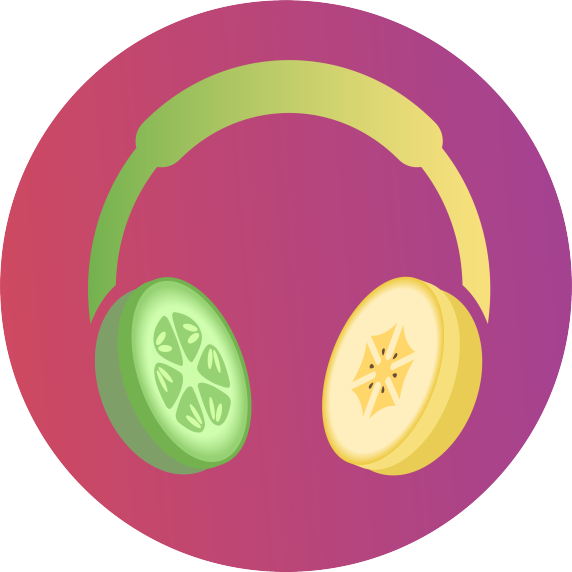

<h1>Cucumber & Banana Music</h1>
<h4>Josh Ferkins, Project Manager</h4>
<h4>Gregor Tutty, Developer</h4>

<h3>Daily Monitoring</h3>
 
<h3><i>04/05/2021</i></h3>

The group was created between Gregor Tutty and Josh Ferkins, the idea and name for the project soon followed. They made concise decisions
based on the main idea of the software project. They have created the idea for an Mp3 media player to rival all others. The idea to implement a 
cloudbased mp3 downloading and converting software followed.

 

A repository has been created for the creation and storing of files for this project. The ReadMe file has been created, this includes...

	<ul>
		<li>Stakeholders</li>
  	<li>Members</li>
		<li>Project Charter</li>
	</ul>
  

The project charter included project goals, constraints and problems, project manager, high level schedule and budget, milestones and approvals.
As this project is very new and there are many things to change and add in all information shown on the ReadMe files may be incorrect and sparse.
All inforation is due to possibly change.

 

This was followed by the creation of this website to aid in monitoring

 
<h4><i>05/05/2021</i></h4>

Tables were added in for extra and more proper layout to the ReadMe. Gregor completed the high-level budget and placed it into a table, this 
was placed underneath the project charter, this helped in completing the project charter. To accomodate the project charter Josh has create and implemented 
a Project Scope statement which included all relative information. Many issues have been resolved today.

 

Josh has completed the stakeholder registry table, changed the layout into tables for majority of information in the ReadMe. Also completed the project scope 
with modifications to the project charter. Josh also completed and is maintaining all monitoring of the project as a part of his position as project manager.

 

Gregor has completed the software success criteria,assessing the project driver, constraints and floats. Also created the requirements for the project
(may require modifications to meet standard). Gregor will also be in charge of creating the logo for C & B Music

 
<h4><i>06/05/2021</i></h4>
 

The client requirements has been created, these requirements are set by the client who will be played by Gregor. These requirements will need to be fulfilled 
in the software. It will be a disappointment for the software if thse requirements are not meet.  Gregor will also be partaking in satisfying these requirements 
despite creating them himself. To avoid this issue of creating requirements that appear to simply the tutor will be stepping in at their leisure and creating 
requirements for us to follow therefore creating more of a challenge and giving us more professional requirements. This has also been followed by a posted 
issue relating to the need to create the requirements.

 

These requirements will aid us in the next steps which will be to create Pseudo-Code and begin the creation and implementation of our plans.

 

The methodology of the groups choosing was the Agile Methodology, the reason that this methodology was chosen over others was its very simple and
useful repeat function. Since it is designed in a circular shape all functions interlock and all end up connecting back to each other. This creates a loop 
to help us improve on aspects that we missed last time around. The speed we go around the methodology depends on the amount of work required. Agile also allows
the group to better interact with the client and the clients requirements. This all together helps in improving the creation of C & B Music.

 
<h4><i>07/05/2021</i></h4>
 

Rhythmic Flow has undergone a name change due to logo issues and similar brand names appearing. The renaming of the project will be C & B Torture which stands
for Cucumber and Banana Music.

 

The logo has been created and implemented into the ReadMe file and eventually the entire project. This logo is visible from the top of the ReadMe file.
This logo displays the slice of both a cucumber and a banana held together by a band creating the combined image of a headset.

 
<h4><i>10/05/2021</i></h4>
 

A large number of the tables have undergone a reconstruction changing them to html tables. These tables include, table, th, td, tr The reason that these
have been changed is to allow for easier manipulation of the tables and better style management in changing the appearances. This was undertaken by Josh.

 
<h4><i>11/05/2021</i></h4>
 

Gregor has completed and implemented the Business Profile. This business profile underlines the introduction of the business and what the main 
purpose of C & B Music is all about, it also shows our mission statement and our vision for the future of the company and the customers, 
and the companies mission.

 

Josh also has completed the business case, this explains the business strategy, this strategy explains the steps we will take to improve the 
company profile and other aspects of the business. The benefits are also explained in this, the benefits explain the positives that will come from
implementing the business strategy. The other additions to the business case are the timescales and the costs. The costs have been pulled from the
more extensive and in depth costs created by Gregor.

 
<h4><i>18/05/2021</i></h4>
 

The creation of the website for the project was undertaken by Josh. It was originally meant to be completed on Repl.it, this seemed like a waste of 
time with the difficulties that it imposed to perform similar functions on Notepad++

 

Upon completion of this website the idea will be to publish the website and constantly update it and supply a link to this website
inside of our GitHub ReadMe or other pages

