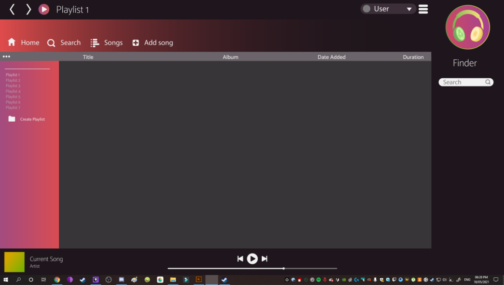
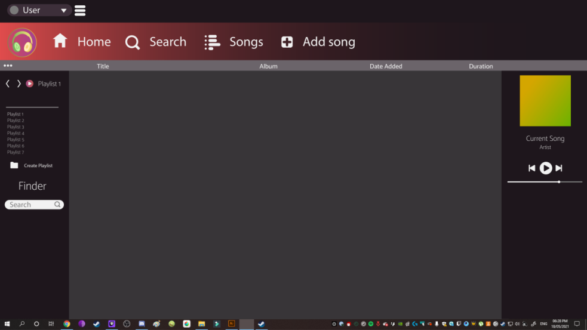
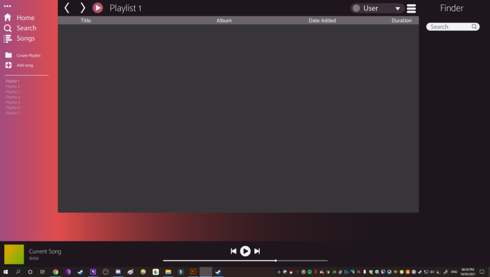
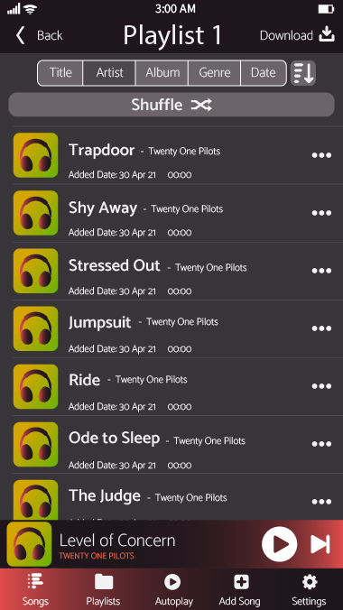
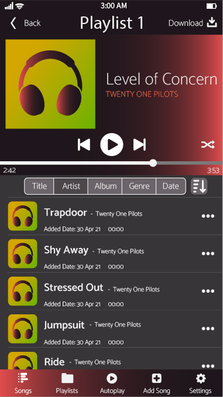

<h1>GUI</h1>

<a id="top"/>
<h3><a href="https://JoshFerkins.github.io/EIT-ac-nz-ITPM5240-202051MB-c-b-torture-Website/">Home</a></h3>

<h4><a href="#persona">Personas</a></h4>

<h2>Computer</h2>
<h3>Wireframes</h3>

These wireframes have been created by Gregor Tutty. These have taken many aspects of multiple mp3 players.

The very first wireframe is the one that has been chosen as the group 'favourite'

<h2>Mobile</h2>

These mobile wireframes have been created in the same style as the computer version to stay intune with the overall theme

<h2>Persona</h2>

<a id="persona"/>
<a href="#top">Back to the top!</a>

