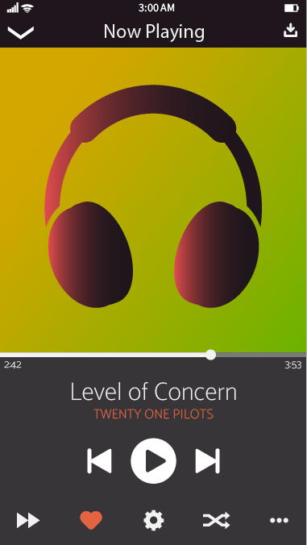

<h1>GUI</h1>

<a id="top"/>
<h3><a href="https://JoshFerkins.github.io/EIT-ac-nz-ITPM5240-202051MB-c-b-torture-Website/">Home</a></h3>

The Graphical User Interface is the main interface all users and customers interact with, Gregor has created many wireframes for both the computer and mobile version of the mp3 player. These help us to gather an idea of how to create the software in the future, they also give to future users and stakeholders a main idea of what to expect from the software. We have also created and implemented personas into this website. A persona is a fake character that is given likes, dislikes and personality. These show us what our future client may be like and we are able to mold the software around their personality, likes and dislikes. They can be viewed by selecting the Personas link just below.

<h4><a href="#persona">Personas</a></h4>

<h2>Computer</h2>
<h3>Wireframes</h3>

These wireframes have been created by Gregor Tutty. These have taken many aspects of multiple mp3 players.

The very first wireframe is the one that has been chosen as the group 'favourite'

<h2>Mobile</h2>

These mobile wireframes have been created in the same style as the computer version to stay intune with the overall theme

<h2>Persona</h2>

<a id="persona"/>
<a href="#top">Back to the top!</a>

