<h3><a href="https://JoshFerkins.github.io/EIT-ac-nz-ITPM5240-202051MB-c-b-torture-Website/">Home</a></h3>
<a id="top"/>

<ul>
  <li><a href="#dep_doc">Deployment Documentation</a></li>
  <li><a href="#pro_guide">Product Usage Guide</a></li>
  <li><a href="#user_guide">User Help Guide</a></li>
  <li><a href="#maint">Maintenance Management</a></li>
</ul>

<h2>Configuration Report</h2>
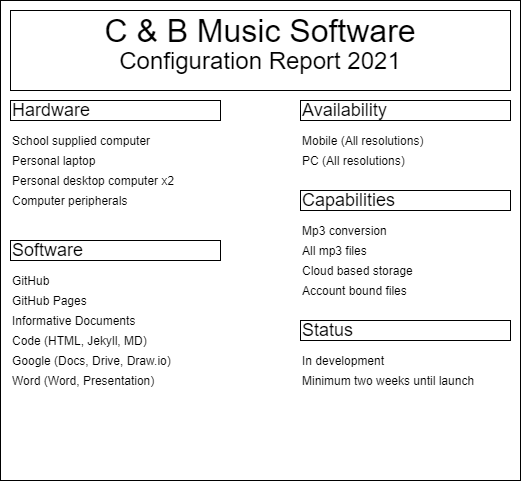   
  
<a id="dep_doc"/>
<a href="#top">Back to the top!</a>

<a id="pro_guide"/>
<a href="#top">Back to the top!</a>
<h2>Product use Guide</h2>
<h3>Computer version usage guide</h3>

This shows how the many features of the product can be used

 
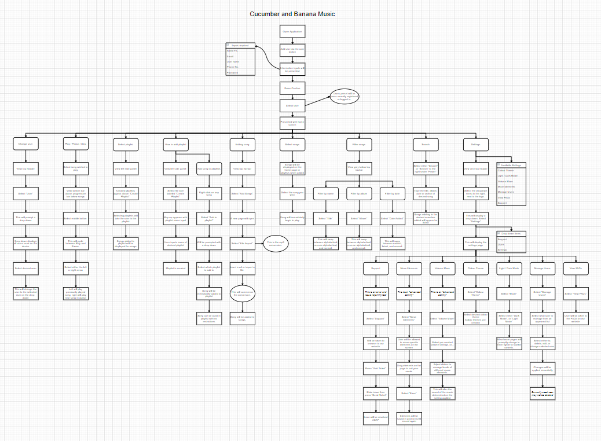
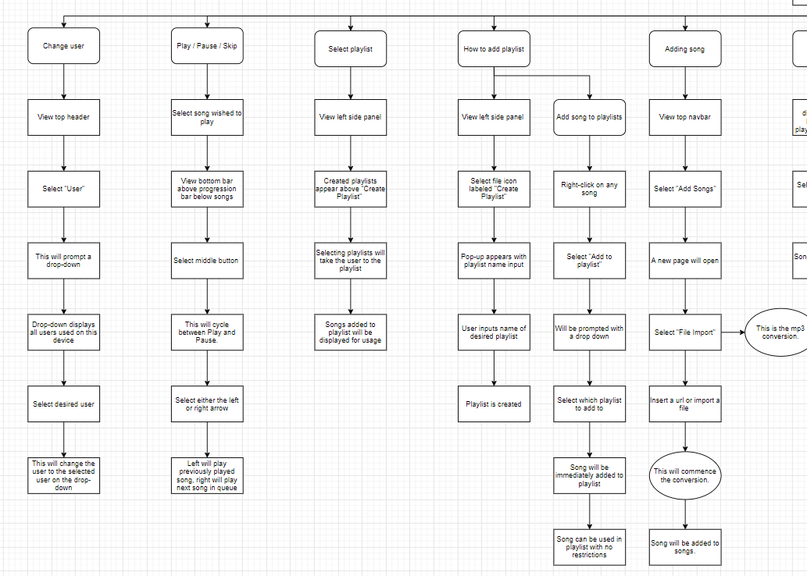
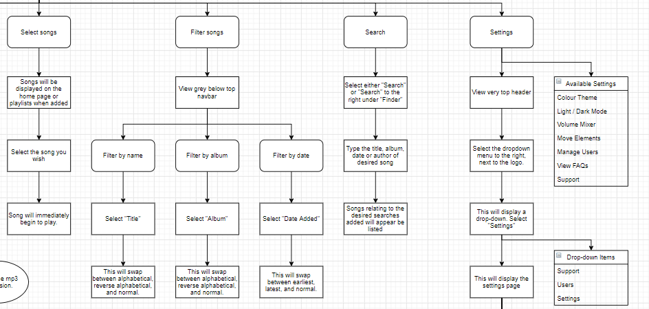
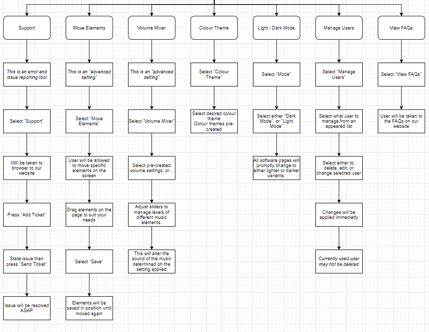
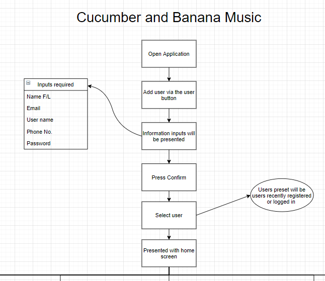

<h3>Mobile version usage guide</h3>

This shows how the many features of the product can be used

 
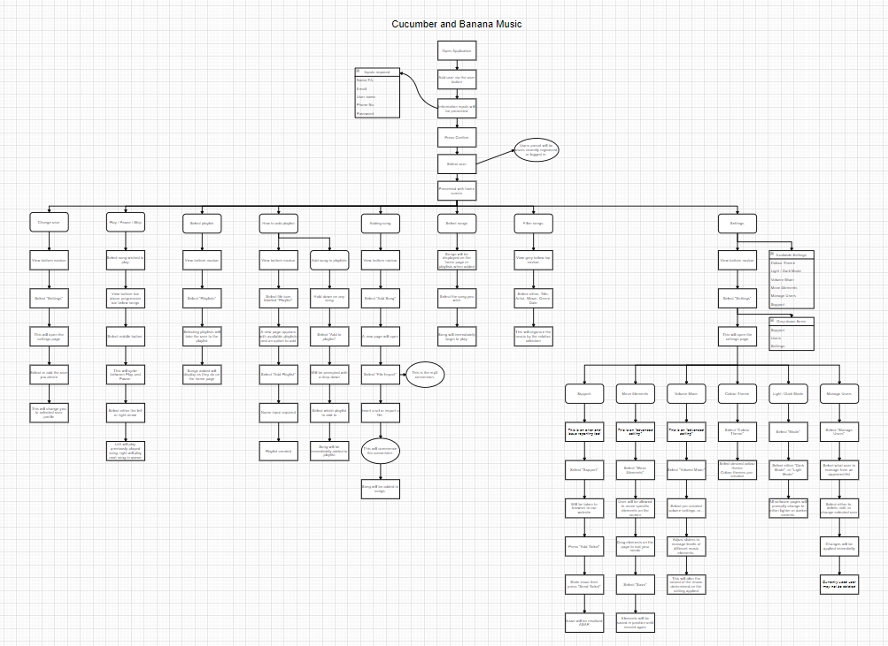
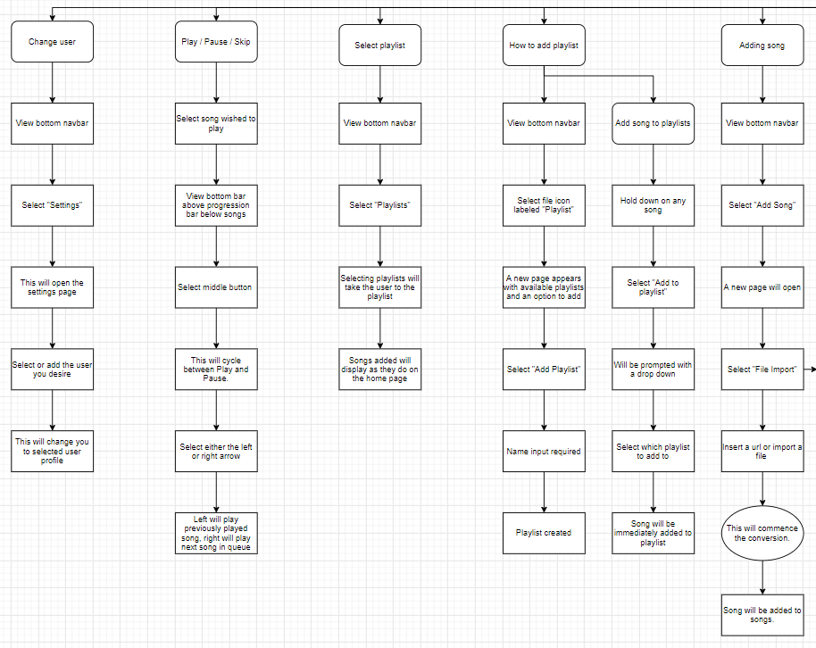
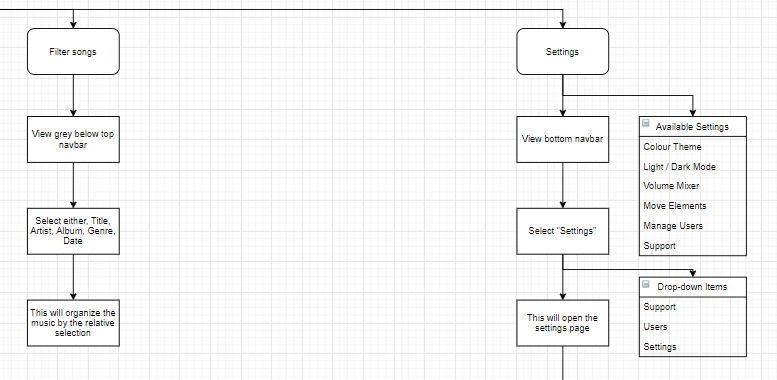
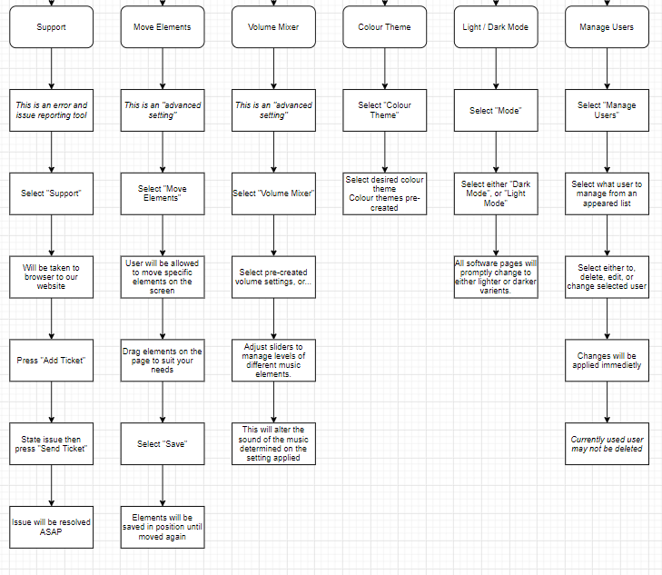
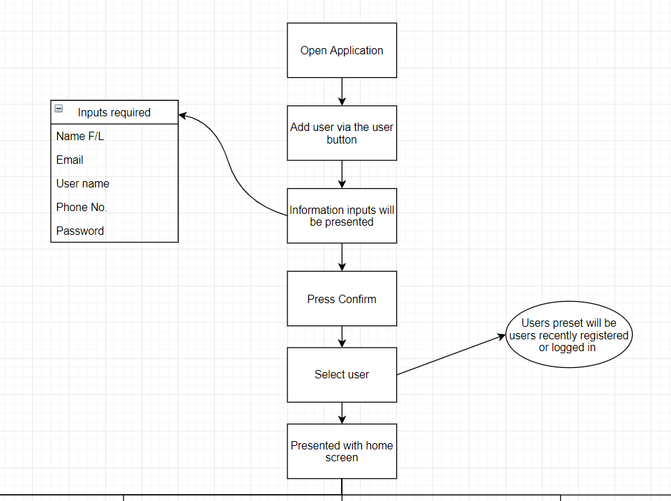

<a id="user_guide"/>
<a href="#top">Back to the top!</a>
<a id="maint"/>
<a href="#top">Back to the top!</a>
<h2>Maintenance management</h2>

If a major or minor error occurs follow the maintenance management procedures to ensure safe and complete execution of solving these issues

<table>
  <tr>
    <th colspan="6" align="center">Maintenance prodecures</th>
  </tr>
  <tr>
    <th>#ID</th>
    <th>Description</th>
    <th>Chance of occurance</th>
    <th>Impact</th>
    <th>Difficulty</th>
    <th>Solution</th>
  </tr>
  <tr>
    <th>1</th>
    <th>Internet Loss</th>
    <th>Medium</th>
    <th>Low - Medium</th>
    <th>Easy</th>
    <th>Check all connections, check modem and with internet provider.</th>
  </tr>
  <tr>
    <th>2</th>
    <th>Accidental file deletion</th>
    <th>Low</th>
    <th>High</th>
    <th>Medium</th>
    <th>Ensure all files are backed up, check recycle bin, attempt to perform a rewind.</th>
  </tr>
  <tr>
    <th>3</th>
    <th>Data loss</th>
    <th>Low</th>
    <th>High</th>
    <th>Difficult</th>
    <th>Ensure all data is back up, check whole system, attempt to perform a rewind.</th>
  </tr>
  <tr>
    <th>4</th>
    <th>Employee loss/abandonment</th>
    <th>Low</th>
    <th>Medium</th>
    <th>Medium</th>
    <th>Allocate ex-employees work to next capable person(s), immediately search for a suitable applicant.</th>
  </tr>
  <tr>
    <th>5</th>
    <th>Employee disagreement/fight</th>
    <th>Low</th>
    <th>Low</th>
    <th>low</th>
    <th>Direct employee to the crying corner to calm down.</th>
  </tr>
  <tr>
    <th>6</th>
    <th>Server down</th>
    <th>Low</th>
    <th>Medium</th>
    <th>Difficult</th>
    <th>Contact person(s) in charge of managing the server.</th>
  </tr>
  <tr>
    <th>7</th>
    <th>Employee lack of attendance</th>
    <th>Medium</th>
    <th>High</th>
    <th>Low</th>
    <th>Interview employee about what we can do to help attendance.</th>
  </tr>
  <tr>
    <th>8</th>
    <th>Damage to artifacts (software or hardware)</th>
    <th>Medium</th>
    <th>High</th>
    <th>Low - Medium</th>
    <th>Fix damaged components and ensure artifact can work as effectiently or, find immediate suitable replacement artifact.</th>
  </tr>
</table>
    
    
