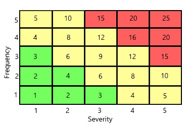

<a id="top"/>

<h1>Handover Page</h1>

<h3><a href="https://JoshFerkins.github.io/EIT-ac-nz-ITPM5240-202051MB-c-b-torture-Website/">Home</a></h3>
<ul>
  <li><a href="#dep_doc">Deployment Documentation</a></li>
  <li><a href="#pro_guide">Product Usage Guide</a></li>
  <li><a href="#user_guide">User Help Guide</a></li>
  <li><a href="#maint">Maintenance Management</a></li>
</ul>

<h2>Configuration Report</h2>
   

<a id="dep_doc"/>
<a href="#top">Back to the top!</a>
<h1>Deployment Documentation</h1>

<h3>Schedule</h3>

<h4>Preperation</h4>

For the preparation stage we will gather all the code required to make the application function such as executables, libraries, configs, and resources. These will be packaged as the single software release that can be downloaded as an application. The website will require a server setup and domain name. A host server must be verified and correctly set up.

 
  
<h4>Testing</h4>

Before an update can be implemented to a live environment, it should be put in a local test server where it can be stress tested and configured. Any immediate bugs can be fixed before being moved to a live environment.

 

<h4>Deployment</h4>

Once the alpha release has been tested it can be moved to the live servers. Once this has happened it is important to stay alert with what customers are saying and to be hyper vigilant about any potential bugs and broken features that could ruin user experience. Hot fixes can be implemented to fix any less obvious bugs that have sneaked into this release.

 

<h4>Release Date: 17th of June 5:00pm</h4>

<ul>
  <li>Rune dedicated website servers</li>
  <li>QA and software test (30 minutes)</li>
  <li>Full life cycle software testing (10 minutes)</li>
  <li>Trial testings (20 minutes)</li>
  <li>Testimonials (varies 10 - 30 minutes)</li>
  <li>User Reviews (Weekly)</li>
  <li>Potiential hotfixes (varies)</li>
  <li>Evalutation (2 days)</li>
</ul>
  
<h3>Deployment Goals</h3>

This deployment of our application will be the alpha release of our application C&B Music. This release must be time and cost efficient and will help further development of the application and keep the application up to date. This alpha release stage will focus on user feedback and is mostly testing and making assessments with a small portion of users.

Our goals for this deployment are as follows:
  
<ul>
  <li>A working website</li>
  <li>Establish communication with the customer</li>
  <li>Ensure the mobile website and application are optimally released</li>
  <li>Gather user feedback</li>
  <li>Record user data for the alpha release</li>
  <li>Evaluating customer feedback</li>
  <li>Eliminating bugs</li>
  <li>Optimised user experience</li>
</ul>

 

Risk management will be a major focus for the application's release. In order to mitigate risks we will need to ensure all following likelihoods and consequences are properly assessed and managed. We will measure the importance of a risk according to the level of probability and Severity for each risk. These will have 3 levels, Critical, Moderate, and Low Severity. Each level is coloured red, yellow, and green respectively.

<h3>Risks</h3>

  
<table>
  <tr>
    <th colspan="4">Risks</th>
  </tr>
  <tr>
    <th>Risk Description</th>
    <th>Severity (x)</th>
    <th>Frequency (y)</th>
    <th>Overall rating (x*y)</th>
  </tr>
  <tr>
    <td>User data insecurity</td>
    <td>5</td>
    <td>3</td>
    <td>15</td>
  </tr>
  <tr>
    <td>Intellectual propety claims</td>
    <td>3</td>
    <td>5</td>
    <td>15</td>
  </tr>
  <tr>
    <td>Server interruptions</td>
    <td>3</td>
    <td>3</td>
    <td>9</td>
  </tr>
  <tr>
    <td>Not enough staff</td>
    <td>3</td>
    <td>2</td>
    <td>6</td>
  </tr>
  <tr>
    <td>Unusable application (bugs)</td>
    <td>1</td>
    <td>5</td>
    <td>5</td>
  </tr>
  <tr>
    <td>Unavailability of media</td>
    <td>2</td>
    <td>2</td>
    <td>4</td>
  </tr>
  <tr>
    <td>Poor connection</td>
    <td>1</td>
    <td>4</td>
    <td>4</td>
  </tr>
  <tr>
    <td>Not enough test users</td>
    <td>3</td>
    <td>1</td>
    <td>3</td>
  </tr>
</table>

 

<a id="pro_guide"/>
<a href="#top">Back to the top!</a>

<h2>Product use Guide</h2>
<h3>Computer version usage guide</h3>

This shows how the many features of the product can be used

 

<h3>Mobile version usage guide</h3>

This shows how the many features of the product can be used

 

<a id="user_guide"/>
<a href="#top">Back to the top!</a>

<h1>User Help Files</h1>

When you first open the application or website you will be registered as a guest. In order to get the most from C&B Music you will need to create an account or log in to an existing account

Creating an account:

When you create a C&B Music account you provide some personal info along with a username and password, by providing this information you can use it to keep your account secure and safe.

<ul>
  <li>Go to the C&B Music sign-in page.</li>
  <li>Click the “Create Account” button.</li>
  <li>Enter your email.</li>
  <li>Enter a username.</li>
  <li>Enter a password.</li>
  <li>Repeat password.</li>
  <li>Optional: Add personal info such as phone number, location, name, etc.</li>
  <li>Click Next.</li>
  <li>Confirm email using the code sent to your email address.</li>
</ul>

Sign in to an existing account

<ul>
  <li>Enter username or email.</li>
  <li>Enter password</li>
  <li>Click “Sign in”.</li>
  <li>If you’re using a new device you’ll need to confirm your email.</li>
  <li>If you have two factor authentication enabled you’ll have to enter your 2FA code</li>
</ul>

<h3>Features</h3>

<h4>Search</h4>

The search bar at the top of the screen allows you to search for:

<ul>
  <li>Songs</li>
  <li>Playlists</li>
  <li>Artists</li>
  <li>Podcasts</li>
  <li>Audiobooks</li>
  <li>Friends</li>
  <li>Users</li>
  <li>Advanced search</li>
</ul>

Using commands you can specify certain details to be searched or omitted from your search, for example

Year=<2000 genre=rock

This search query will retrieve rock songs from before 2000

<b>Commands:</b>

<ul>
  <li>Year=</li>
  <li>Genre=</li>
  <li>Artist=</li>
  <li>Length=</li>
</ul>

<h3>Songs List</h3>

In your Songs List you will find all music that has been downloaded, favorited, or added to your playlists. You can add songs to your list by searching for them or adding already downloaded songs from your computer.

<h3>Music Player</h3>

Your Music Player will show the music currently selected, duration, time slider, play/pause, skip, shuffle, loop, and volume meter. This will always be located at the bottom of your screen.

<h3>Playlists</h3>

Create new playlists with the Create Playlist button (A new playlist requires a name). Created or saved playlists can be found on the left side. Selected playlists show up at the top with their songs listed in the center of the screen. Another user’s playlists can be added to your selection but cannot be edited.

<h3>Friends List</h3>

You can search for a friend’s C&B account and add them, share music with them, etc. Added friends will show up on the right side when they’re online, friends list can be accessed using the drop down in the top right.

<h2>Account Help</h2>

<h3>Account Info</h3>

Under settings go to “Account Details” here you can change your region/country, profile picture, username, and DoB. You may also suspend or fully disable your account at the bottom of this screen.

  
<h3>Payment Help</h3>

You can send a support ticket under settings, support, add ticket.

You can request to:

<ul>
  <li>See Receipts</li>
  <li>See Payment details</li>
  <li>Validate gift card</li>
  <li>Report failed payments</li>
  <li>Request refund</li>
  <li>Cancel premium plans</li>
  <li>Dispute charges</li>
</ul>

<h3>Privacy and Security</h3>

Under settings you can go to privacy settings and change what data C&B Music keeps. You can also request to download your personal data and change what others can see on your account. From here you can also navigate to our privacy policy.

<h3>Account Recovery</h3>

If you have forgotten your password or username you can click “Forgot Password” to send an email confirming a password reset.  You are advised to use 2FA and a complex password. Do not give away your login details to anyone. If you believe your account has been hacked you need to change your password then navigate to your account page and click sign out on all devices.

<h3>Migrate Account</h3>

If you need to move emails or change 2FA to another account follow these steps:

<ul>
  <li>Log into your old C&B account</li>
  <li>Go to settings</li>
  <li>Select Support</li>
  <li>Request migration to new email or 2FA device change</li>
</ul>

<h3>Explicit Content</h3>

If you would like to filter out explicit content you can select this under settings, manage users, and toggle “hide explicit content”. You can enable a “clean version only” feature which only allows for clean versions of a song (if the artist has made this available). Any inappropriately tagged songs should be reported.

<h2>Application Settings</h2>

<h3>Change Language</h3>

Your language is automatically set according to your region, if you would like to change your language you can navigate to Settings, and change the language, there are flags for each language.

<h2>Keyboard Shortcuts</h2>

Keyboard shortcuts include

<ul>
  <li>Space to play/pause</li>
  <li>Left/right arrow to skip 2 seconds</li>
  <li>Ctrl + left/right arrow to skip song</li>
  <li>Ctrl + S to toggle shuffle</li>
  <li>Ctrl + R to repeat a song</li>
  <li>Up/down arrow to change volume</li>
  <li>Ctrl + F to search list for specific songs/artists</li>
  <li>Ctrl + Z to Undo deleted playlist or song</li>
</ul>

If you would like to view or change keyboard shortcuts you can see them under settings, advanced settings, keyboard shortcuts.

<h3>Update</h3>

When an update is ready you will be prompted to update and restart when you open up the application.

<h3>Uninstall</h3>

If you wish to uninstall you can do so by following these steps:

<ul>
  <li>Exit C&B Music</li>
  <li>Click Start, then settings.</li>
  <li>Click apps then C&B Music</li>
  <li>Uninstall C&B Music</li>
</ul>

<h3>Local Storage Files</h3>

To find where downloads and songs are kept you can follow these steps:

<ul>
 <li>Go to settings</li>
 <li>Go to advanced</li>
 <li>Scroll down to see file location</li>
 <li>Go to that folder in your file explorer</li>
</ul>

<h3>Privacy</h3>

Friends can see your playlists, current song, and recent activity. If you want to make these private you can go to settings, then privacy. You can change what is public and what is private.

<h2>Other</h2>

<h3>Report a Text, Image, or Playlist</h3>

If a song or playlist is inappropriate you can report it to C&B Music’s moderation team. Abusing the report function can lead to your accounts suspension or deletion. In order to report a song, playlist or account you must follow these steps:

<ul>
  <li>right click the offensive material</li>
  <li>Click report</li>
  <li>Enter in report details and summary</li>
  <li>Send to moderation.</li>
</ul>

<h2>Report Stolen Content</h2>

If someone has stolen content or material that you or another own you can submit a takedown request to have the stolen material removed from the C&B platform. To report   
stolen material you can follow these steps:

<ul>
  <li>Right click the stolen song or image.</li>
  <li>Click report.</li>
  <li>Select “stolen material”</li>
  <li>Send the copyright report.</li>
</ul>

<a id="maint"/>
<a href="#top">Back to the top!</a>
<h2>Maintenance management</h2>

If a major or minor error occurs follow the maintenance management procedures to ensure safe and complete execution of solving these issues

<table>
  <tr>
    <th colspan="6" align="center">Maintenance prodecures</th>
  </tr>
  <tr>
    <th>#ID</th>
    <th>Description</th>
    <th>Chance of occurance</th>
    <th>Impact</th>
    <th>Difficulty</th>
    <th>Solution</th>
  </tr>
  <tr>
    <th>1</th>
    <th>Internet Loss</th>
    <th>Medium</th>
    <th>Low - Medium</th>
    <th>Easy</th>
    <th>Check all connections, check modem and with internet provider.</th>
  </tr>
  <tr>
    <th>2</th>
    <th>Accidental file deletion</th>
    <th>Low</th>
    <th>High</th>
    <th>Medium</th>
    <th>Ensure all files are backed up, check recycle bin, attempt to perform a rewind.</th>
  </tr>
  <tr>
    <th>3</th>
    <th>Data loss</th>
    <th>Low</th>
    <th>High</th>
    <th>Difficult</th>
    <th>Ensure all data is back up, check whole system, attempt to perform a rewind.</th>
  </tr>
  <tr>
    <th>4</th>
    <th>Employee loss/abandonment</th>
    <th>Low</th>
    <th>Medium</th>
    <th>Medium</th>
    <th>Allocate ex-employees work to next capable person(s), immediately search for a suitable applicant.</th>
  </tr>
  <tr>
    <th>5</th>
    <th>Employee disagreement/fight</th>
    <th>Low</th>
    <th>Low</th>
    <th>low</th>
    <th>Direct employee to the crying corner to calm down.</th>
  </tr>
  <tr>
    <th>6</th>
    <th>Server down</th>
    <th>Low</th>
    <th>Medium</th>
    <th>Difficult</th>
    <th>Contact person(s) in charge of managing the server.</th>
  </tr>
  <tr>
    <th>7</th>
    <th>Employee lack of attendance</th>
    <th>Medium</th>
    <th>High</th>
    <th>Low</th>
    <th>Interview employee about what we can do to help attendance.</th>
  </tr>
  <tr>
    <th>8</th>
    <th>Damage to artifacts (software or hardware)</th>
    <th>Medium</th>
    <th>High</th>
    <th>Low - Medium</th>
    <th>Fix damaged components and ensure artifact can work as effectiently or, find immediate suitable replacement artifact.</th>
  </tr>
</table>
    
    
